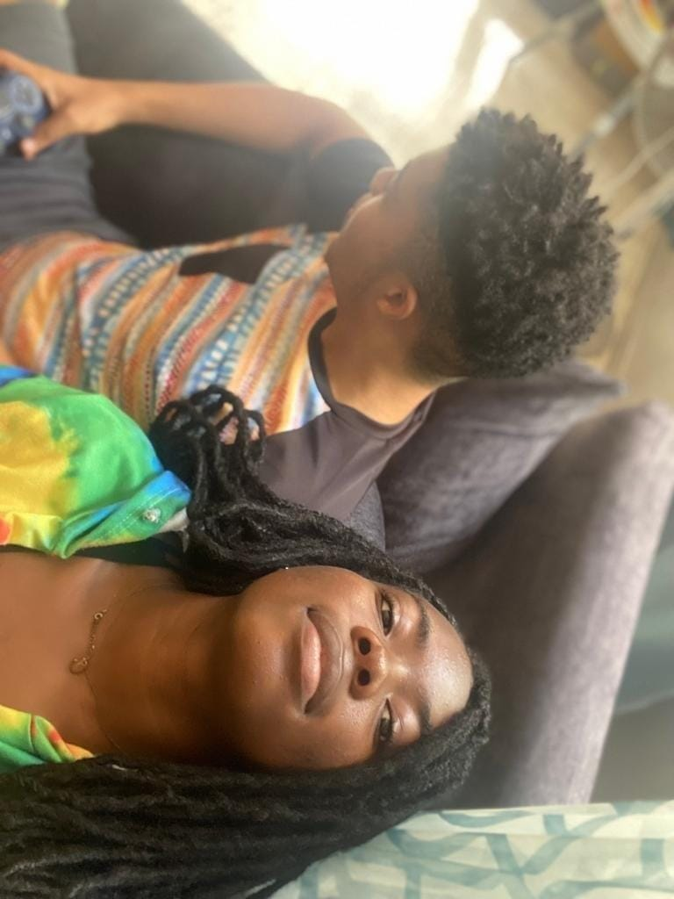
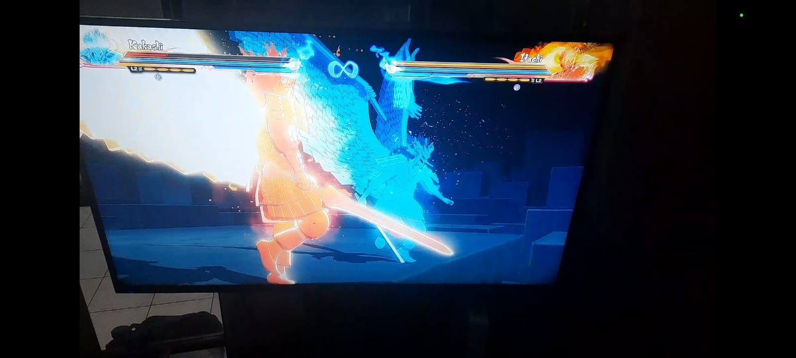
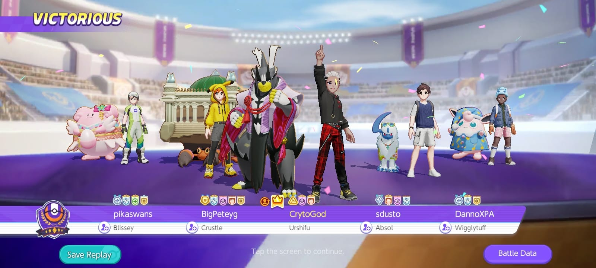
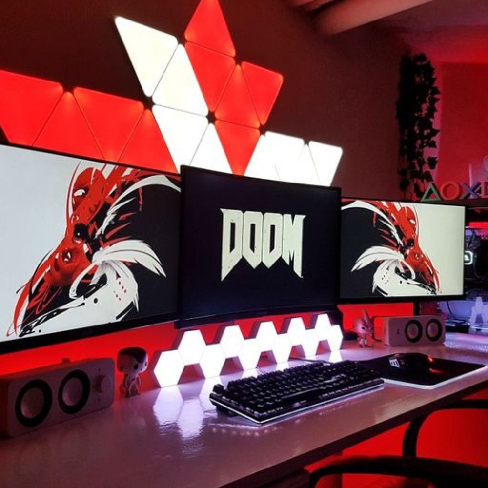
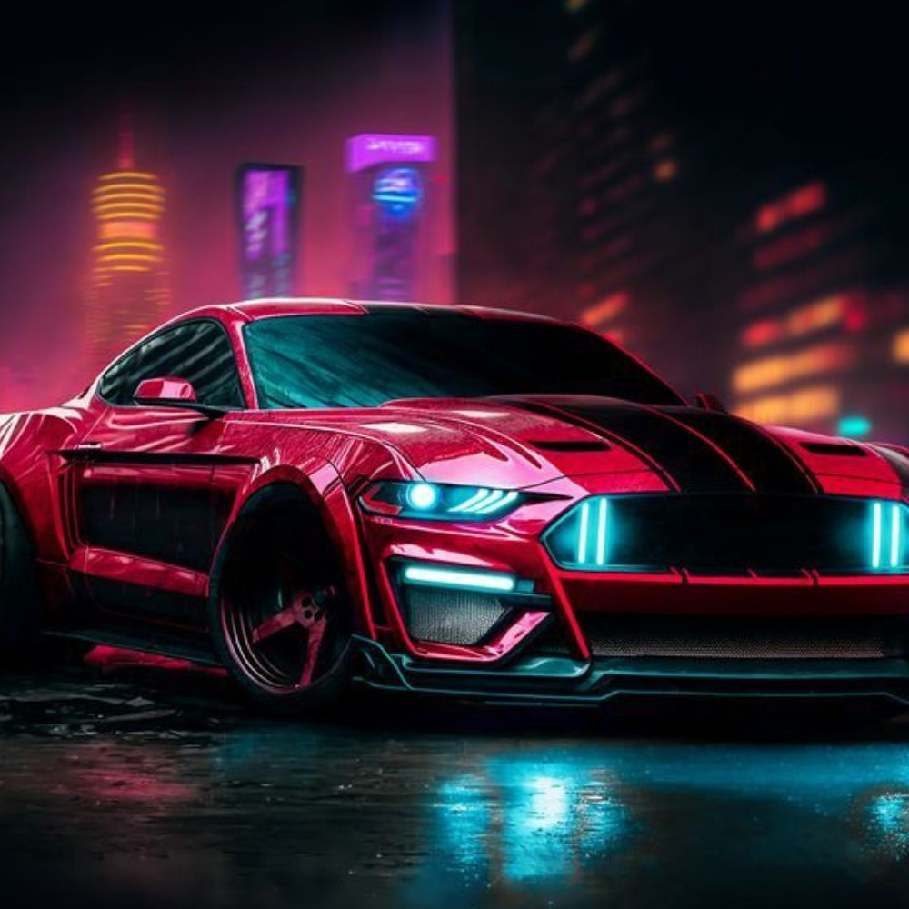

# Red Lanterns
"Red Lanterns: Igniting Excellence Together"

## Hello! I'm Amari Buck, and I'd like to share a bit about myself. This repository serves as a glimpse into my background, interests, and experiences. Feel free to explore and get to know me better.
**Hobbies:** Playing video games, Drawing, Writing Music and watching anime 

I'm a person who embodies a delightful blend of fun-loving and occasionally shy qualities, wrapped in a deep sense of love and affection. I thrive in moments of joy, always ready to share laughter and create cherished memories with friends and loved ones. Yet, there are times when my introverted side shines through, making me a bit reserved and reflective. This shyness allows me to appreciate the quiet moments and introspection that are equally important in life. Above all, love is at the core of my being. I love deeply, whether it's for family, friends, or the world around me. This love fuels my compassion, empathy, and willingness to connect with others on a profound level. It's this combination of fun-loving spirit, occasional shyness, and boundless love that shapes the unique and caring individual that I am.

**Favourite Anime:**
1. Demon Slayer
2. My Hero
3. Dragon Ball 
4. Bleach
5. Black Clover

[My favorite Anime website](https://ww.kiss-anime.uk/home)

**Favourite Video Games:**
1. Demon Slayer
2. Naruto Ninja Storm 4
3. Dragon Ball 
4. God of war 
5. Zelda
6. Pokemon

https://github.com/CrytoGod/buck_a_homework1/assets/145210773/6bb43e86-c40a-4389-b430-429048d709ba

https://github.com/CrytoGod/buck_a_homework1/assets/145210773/e6b6ae5c-8184-4fd5-9d27-80b5b4b77fe7

# Member 2

## My name is Emmanuel, I come from the western part of Africa, Nigeria.   I am a Christian.  My favorite color is Red.

**Hobbies:** Gaming, Movies, Watching Tech, Food, cars and bike videos

I'm a dynamic individual who finds immense joy in the simple pleasures of life. My fun-loving spirit shines through in my passion for experiencing new adventures, sharing laughter with friends, and savoring delicious culinary delights. As a self-proclaimed food enthusiast, I relish exploring diverse cuisines and trying out local delicacies whenever I can. Whether it's savoring a gourmet meal or indulging in street food, I find that food has a magical way of connecting people and cultures. Alongside my love for gastronomy, I also have a deep appreciation for technology. I consider myself a tech enthusiast, always eager to stay up-to-date with the latest gadgets and advancements. This techy side of me drives my curiosity and creativity, as I enjoy experimenting with innovative tech tools and exploring how they can enhance various aspects of our lives. So, whether it's savoring a delectable dish or diving into the ever-evolving world of technology, I embrace the vibrant and multifaceted experiences that life has to offer.

**Favourite Anime:**
1. Demon Slayer
2. Cowboy Bebop
3. Hunter X Hunter
4. Attack on Titans
5. Black Clover

[My favorite website](https://www.youtube.com)

**Favourite Video Games:**
1. Need For Speed
2. Mortal Kombat
3. Grand Theft Auto
4. God of war 
5. Devil May Cry
6. Grand Turismo

https://github.com/CrytoGod/buck_a_homework1/assets/145210773/6973aa17-69d9-4cae-bcf7-8e09a8222dd9

&copy; Repo-Collab 2023.
